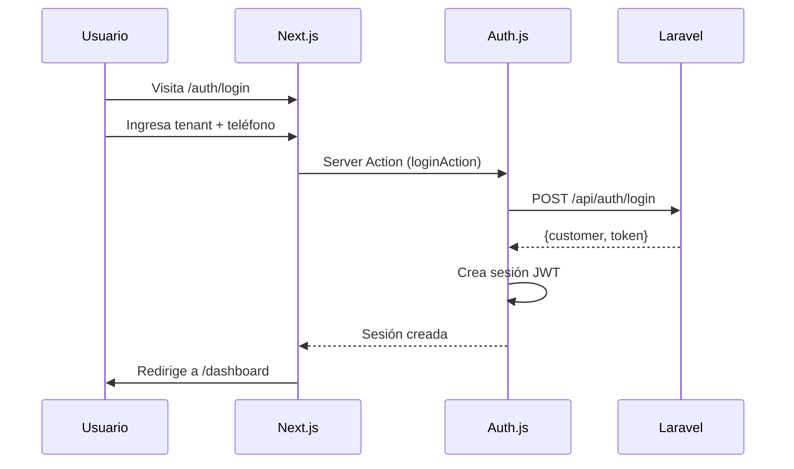

# 🌐 Booking Web - Aplicación Web Multi-Tenant

Aplicación web moderna para sistema de reservas multi-tenant construida con **Next.js 16**, **Auth.js**, y **shadcn/ui**.

## 📋 Requisitos Previos

- **Node.js** 18 o superior
- **npm** o **yarn**
- **Backend Laravel** corriendo (`booking-saas`)

## 🚀 Inicio Rápido

### 1. Instalar Dependencias

```bash
npm install
```

### 2. Configurar Variables de Entorno

Crea un archivo `.env.local` en la raíz del proyecto:

```bash
# API Configuration
NEXT_PUBLIC_API_URL=http://localhost:8000/api

# Auth.js Configuration
AUTH_SECRET=super-secret-key-change-in-production-please
AUTH_URL=http://localhost:3000

# App Configuration
NEXT_PUBLIC_APP_NAME=Booking App
NEXT_PUBLIC_APP_URL=http://localhost:3000
```

> ⚠️ **Importante**: 
> - Asegúrate que el backend Laravel esté corriendo en `http://localhost:8000`
> - Genera un `AUTH_SECRET` seguro para producción: `openssl rand -base64 32`

### 3. Ejecutar en Desarrollo

```bash
npm run dev
```

La aplicación estará disponible en `http://localhost:3000`

## 🔑 Credenciales de Prueba

Usa las mismas credenciales que en la app móvil:

### Tenants Disponibles
- `demo-barbershop`
- `elegant-salon`

### Clientes de Prueba

| Nombre | Teléfono |
|--------|----------|
| John Doe | `+1111111111` |
| Jane Smith | `+2222222222` |
| Bob Johnson | `+3333333333` |

### Flujo de Login
1. Ve a `http://localhost:3000`
2. Ingresa tenant: `elegant-salon`
3. Ingresa teléfono: `+1111111111`
4. Click en "Iniciar Sesión"

## 📁 Estructura del Proyecto

```
booking-web/
├── actions/                    # Server Actions (Next.js 16)
│   └── auth.ts                # Acciones de autenticación
├── app/
│   ├── api/
│   │   └── auth/
│   │       └── [...nextauth]/ # Rutas API de Auth.js
│   ├── auth/
│   │   └── login/            # Página de login
│   ├── dashboard/            # Dashboard protegido
│   ├── layout.tsx            # Layout raíz
│   ├── page.tsx              # Home (redirige)
│   └── globals.css           # Estilos globales
├── components/
│   ├── ui/                   # Componentes shadcn/ui
│   ├── theme-provider.tsx    # Provider de tema
│   └── theme-toggle.tsx      # Toggle modo oscuro
├── lib/
│   ├── api-client.ts         # Cliente Axios
│   ├── auth-api.ts           # Funciones API de auth
│   └── utils.ts              # Utilidades
├── types/
│   ├── index.ts              # Types de modelos
│   └── schemas.ts            # Schemas de Zod
├── auth.ts                   # Configuración Auth.js
├── middleware.ts             # Protección de rutas
└── .env.local               # Variables de entorno
```

## 🎨 Stack Tecnológico

### Core
- **Next.js 16** - Framework React con App Router
- **React 19** - Biblioteca UI
- **TypeScript 5** - Tipado estático

### Autenticación
- **Auth.js (NextAuth v5)** - Autenticación
- **Axios** - Cliente HTTP para Laravel API

### UI/UX
- **Tailwind CSS 4** - Estilos
- **shadcn/ui** - Biblioteca de componentes
- **Lucide React** - Iconos
- **next-themes** - Modo oscuro
- **React Hook Form** - Manejo de formularios
- **Zod** - Validación

## 🔐 Flujo de Autenticación



## 🛠️ Scripts Disponibles

```bash
# Desarrollo
npm run dev              # Inicia servidor de desarrollo
npm run build            # Construye para producción
npm run start            # Inicia servidor de producción
npm run lint             # Ejecuta ESLint

# shadcn/ui
npx shadcn@latest add [componente]  # Agrega nuevo componente
```

## ✨ Características Implementadas

### Completadas ✅
- [x] Autenticación con Auth.js
- [x] Login con tenant + teléfono
- [x] Rutas protegidas (middleware)
- [x] Dashboard con información del cliente
- [x] Diseño responsive
- [x] Modo oscuro
- [x] Cliente API type-safe
- [x] Server Actions (Next.js 16)
- [x] Validación con Zod
- [x] Interfaz en español

### Próximamente 🚧
- [ ] Página de registro
- [ ] Sistema de reservas
- [ ] Lista de citas
- [ ] Gestión de perfil
- [ ] Catálogo de servicios
- [ ] Selección de personal
- [ ] Vista de calendario

## 🎯 Diferencias con la App Móvil

| Característica | App Móvil | App Web |
|----------------|-----------|---------|
| **Auth** | AsyncStorage | Auth.js sessions |
| **Estado** | Zustand | Server Components + Auth.js |
| **Navegación** | Expo Router | Next.js App Router |
| **Storage** | AsyncStorage | Cookies (httpOnly) |
| **Rendering** | Client-side | Server + Client |
| **Validación** | Manual | Zod schemas |
| **Forms** | useState | Server Actions |

## 📝 Variables de Entorno

| Variable | Descripción | Por Defecto |
|----------|-------------|-------------|
| `NEXT_PUBLIC_API_URL` | URL de la API Laravel | `http://localhost:8000/api` |
| `AUTH_SECRET` | Clave secreta de Auth.js | Requerido |
| `AUTH_URL` | URL de la aplicación | `http://localhost:3000` |

## 🐛 Solución de Problemas

### Error "Credenciales inválidas"
- Verifica que el backend Laravel esté corriendo
- Revisa que `NEXT_PUBLIC_API_URL` sea correcta
- Asegúrate que el tenant exista en la base de datos
- Verifica que el número de teléfono esté registrado

### La sesión no persiste
- Verifica que `AUTH_SECRET` esté configurado
- Limpia las cookies del navegador
- Reinicia el servidor de desarrollo

### Errores de CORS
- Asegúrate que Laravel CORS esté configurado
- Revisa `config/cors.php` en Laravel
- Agrega `http://localhost:3000` a los orígenes permitidos

### Errores de TypeScript
- Ejecuta `npm run build` para verificar errores
- Revisa que todos los types estén importados correctamente
- Asegúrate que `@/types` esté en el path de TypeScript

## 🚀 Despliegue

### Vercel (Recomendado)

```bash
# Instalar Vercel CLI
npm i -g vercel

# Desplegar
vercel
```

### Variables de Entorno en Producción
1. Configura todas las variables de `.env.local` en el dashboard de Vercel
2. Genera un `AUTH_SECRET` seguro: `openssl rand -base64 32`
3. Actualiza `AUTH_URL` al dominio de producción
4. Actualiza `NEXT_PUBLIC_API_URL` a la API de producción

### Build Local

```bash
npm run build
npm run start
```

## 🏗️ Arquitectura

### Server Actions
Usamos Server Actions de Next.js 16 para manejar formularios y mutaciones:

```typescript
// actions/auth.ts
'use server';

export async function loginAction(prevState, formData) {
  // Validación con Zod
  // Autenticación con Auth.js
  // Retorna estado
}
```

### Validación Centralizada
Todos los schemas de validación están en `types/schemas.ts`:

```typescript
export const loginSchema = z.object({
  tenant_slug: z.string().min(1, 'El tenant es requerido'),
  phone: z.string().min(1, 'El teléfono es requerido'),
});
```

### Types Compartidos
Los types están organizados en `types/`:
- `index.ts` - Types de modelos (Customer, Tenant, etc.)
- `schemas.ts` - Schemas de Zod para validación

## 📚 Documentación

- [Next.js 16 Docs](https://nextjs.org/docs)
- [Auth.js Docs](https://authjs.dev)
- [shadcn/ui Docs](https://ui.shadcn.com)
- [Tailwind CSS Docs](https://tailwindcss.com)
- [Zod Docs](https://zod.dev)

## 🤝 Contribución

Este es un proyecto de portafolio para demostrar un sistema de reservas multi-tenant completo.

## 📄 Licencia

MIT License

---

**Desarrollado con ❤️ usando Next.js 16, Auth.js y shadcn/ui**
